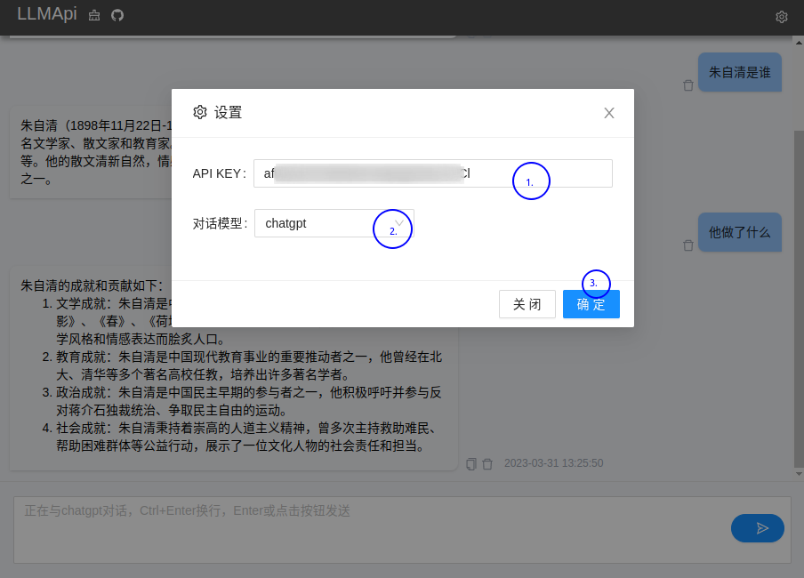

<p align="center">
  
  <h1 align="center">LLMApi Chat</h1>
  <p align="center">可私有化部署的ChatGPT WEB聊天服务端</p>
</p>


# 介绍

[English](README.en.md)

llmapi-chat 基于llmapi.io服务提供了简单的聊天服务器后端，可以直接和`ChatGPT` `GPT-3` `llama`等大模型聊天交互

## 安装和运行

1. 本地安装运行
``` shell
./build.sh
./start.sh
```

2. 使用docker运行

``` shell
docker build -t llmapi-chat:0.1.0 .
docker run --name webchat -d -p 8081:8081 llmapi-chat:0.1.0
```

## 访问

> 在浏览器打开:`http://127.0.0.1:8081`即可访问webchat页面

你可以在[llmapi.io](https://llmapi.io)上注册账号即可获得`apikey`，按照以下示例，完成配置后即可与`ChatGPT` `GPT-3`以及其他流行的LLM进行聊天:

<p align="center">
  
</p>

### 致谢
本项目基于[chatGPT-web](https://github.com/mic1on/chatGPT-web)开发
